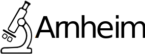
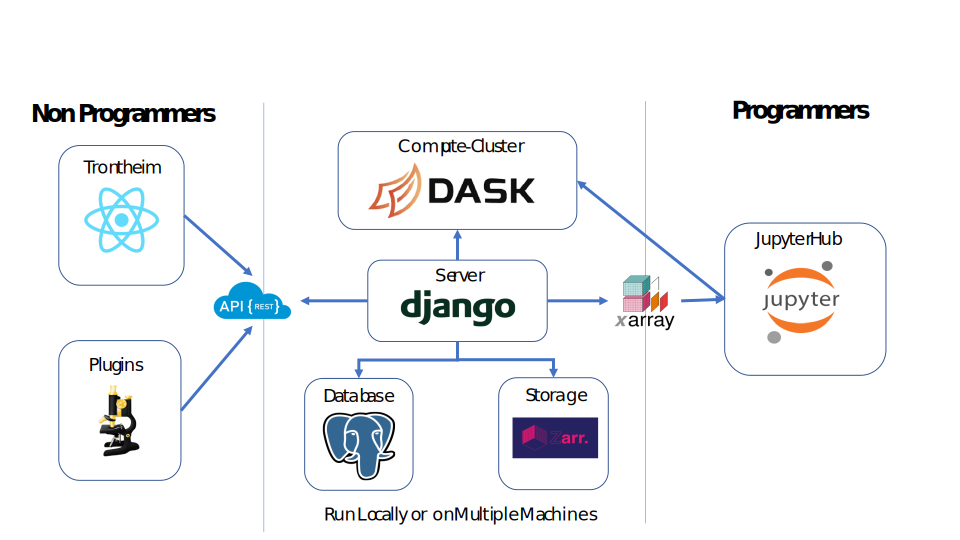

#### Consider this a preview, as the ineptly norwegian codenames might suggest

### Idea

This is a basic implementation of the Arnheim Framework, that seeks to implement a working pipeline for the processing
and analysis of microscopic data. Arnheim uses Docker-Containers to ensure most of its workflow is as modular and scalable as
possible. Its architrecture consists of

 * Bergen (the Backend, a django-driven API-Backend)
 * Trontheim (the Frontend, react-based orchestrator of the modules, separate GitHub)
 * Arbeider ( a worker module that connects to the channel layer and ORM (can isolate heavyweight dependencies like tensorflow and Java)
 * Database (either sqlite or postgres database for object persistence)
 * JupJup (the Jupyter-Server for easy Access to the Models Provided and the Dask Runtime)
 * Dask (Scheduler and Worker for cluster analysis)


 
Production Modules are also included in this repository: Apache Kafka, Certbot, VSCode

Arnheim uses OAuth system to provide authoriazion and authentification; users are only able to
use the application once registered on the backend, and can login from a variety of different clients (checkout foreign for a 
working implementation using PyQT)

Real-Time Communication is based on an implementation of Django-Channels that is only available for signed-in users.

### Design



### Prerequisites

As Arnheim is based on Docker it needs a working Docker instance running on your Machine
(detailed instructions found on [Docker Get Started](https://docs.docker.com/get-started/))


### Installing

Once this repository is cloned, cd into the parent directory and adjust the docker-compose.yml
according to your needs ( a good place to start is adjusting the media directories according to your file structure)
once adjusted run (with admin privileges)

```
docker-compose up
```

This should cause the initial installation of all required libraries through docker, (please be patient)

### Running

From now on you can run the project through 
```
docker-compose up
```
### Kubernetes

A helm based kubernetes charts is on the roadmap. So far scaling is done via 
''' 
docker-compose scale abeider=2
'''
for local development onlny

## Populating the Database

As there is no initial Database provided you need to setup the Database with a Superuser before starting to do so check the django tutorial on [superuser creation](https://developer.mozilla.org/en-US/docs/Learn/Server-side/Django/Admin_site)
Beware that Django commands like

```
python3 manage.py createsuperuser
```

translate to

```
docker-compose run web python manage.py createsuperuser
```
in the Docker context

# Basic Information

## Node and Arbeider modules

Modularity is at the heart of the framework. Arnheim relies heavily on the idea of representating an analysis workflow as a graph with multiple nodes. Each node represents an analysis task (for example an Maximum Intensity projection, Edge Enhancing Filter, ROI Isolation,...) that can be chained together with another task. These graphs can then run in batch and intermitten user interaction. (for detailed information visit the documentation (ones up)).

Nodes can be implemented in a variety of programming languages (that can consume task from a REDIS queue and access a postgres database) and are easyily encapsulated in a Docker container. However in order to facilitate the development of these Nodes the framework provided the Arbeider Template:

These modules can rely on the django ORM to access the database, the Dask Cluster, xarray as an accesible interface for the multidimensional arrays, as well as using bindings to tensorflow or the Java ecosystem of image analysis (if so desired through extension of the standard template).

Here an example of a standard implementation of a Node within the arbeider framework

```python

@register_consumer("maxisp",model= Filter)
class MaxIntensityProjection(FilterConsumer):
    name = "Max ISP"
    path = "MaxISP"
    unique = "maxisp"
    settings = {"reload": True}
    inputs = [Representation]
    outputs = [Representation]

    @staticmethod
    def filter(array: xr.DataArray, settings: dict, manager: LarvikManager) -> xr.DataArray:
        return array.max(dim="z", keep_attrs=True)

```

These nodes than can be registered within the framework with a call to

```
docker-compose run %arbeider% python manage.py discoverworkers
```


### Testing and Documentation

So far Arnheim does not provide unit-tests and is in desperate need of documentation,
please beware that you are using an Alpha-Version


### Roadmap

- Import and Export of Samples
- Implementation of standard image processing
- Machine Learning Pipeline (Kafka)
- ~~Transition to Zarr (dropping HDF5, for multithreaded access)~~ done

## Deployment

Contact the Developer before you plan to deploy this App, it is NOT ready for public release

## Built With

* [Docker](http://www.dropwizard.io/1.0.2/docs/) - Architecture
* [Django](https://maven.apache.org/) - Web Server in python
* [Django-Channels](https://rometools.github.io/rome/) - Used for real-time-communictation
* [python-bioimage](https://bio-it.embl.de/image-analysis-with-python/) - Used to read vendor microscopy format

## Contributing

Please read [CONTRIBUTING.md](https://gist.github.com/jhnnsrs/b24679402957c63ec426) for details on our code of conduct, and the process for submitting pull requests to us.

## Versioning

There is not yet a working versioning profile in place, consider non-stable for every release 

## Authors

* **Johannes Roos ** - *Initial work* - [jhnnsrs](https://github.com/jhnnsrs)

See also the list of [contributors](https://github.com/your/project/contributors) who participated in this project.


## Acknowledgments

* EVERY single open-source project this library used (the list is too extensive so far)
